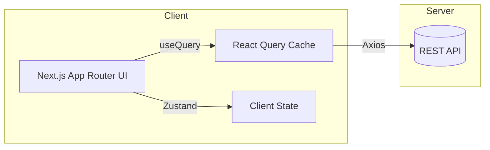

# 🍽️ 오메추 (오늘 뭐 먹지?)

<div align="center">
  
  
  
  
  
  
  
</div>

<p align="center">
  사용자 기본 상태와 취향을 바탕으로 <b>상황 맞춤 메뉴/맛집을 추천</b>하는 웹 서비스
</p>

<p align="center">
  <a href="https://omechu.log8.kr/">🐥 배포 URL</a> ·
  데모 계정: <code>user@example.com / User1234!</code>
</p>

---

## 📌 개요

**오메추**는 사용자의 기본 상태·취향·컨디션 같은 맥락을 반영해 **맞춤 메뉴와 근처 맛집을 빠르게 추천**합니다. 목표는 단순합니다. 고민 시간을 줄이고, 선택을 더 즐겁게 만들기.

### 문제 인식

* 반복되는 “오늘 뭐 먹지?”에서 오는 **의사결정 피로**
* 광고/검색 중심 리스트로 인한 **정보 과잉**과 **개인 맥락 미반영**
* **새로고침/이탈 시 상태 유실**, 느린 응답, 빈약한 폴백 등 UX 끊김

### 접근

1. **온보딩 5단계**로 최소 입력으로 핵심 신호 수집
2. **컨텍스트 기반 탐색**: 태그·가격·정렬·검색(디바운스) + **무한 스크롤**
3. **상세 페이지 실사용 시나리오**: 리뷰 정렬/필터, 신고, 이미지 폴백, 평점 요약
4. **마이페이지**에서 상태/취향 재설정 → 추천 품질 순환 개선

> 현재 추천은 **규칙 기반 필터+정렬**로 안정 운영 중이며, 이후 **개인화 점수/가중치** 기반 모델로 고도화 예정.

---

## 🧭 빠른 링크

* [아키텍처](#-아키텍처)
* [주요 기능](#-주요-기능)
* [설치 및 실행](#-설치-및-실행)
* [폴더 구조](#-폴더-구조)
* [기술 스택](#-기술-스택)
* [협업 규칙/커밋 컨벤션](#-협업-규칙)
* [트러블슈팅](#-트러블슈팅--해결-과정)
* [AI 활용](#-ai-활용-내역)
* [로드맵](#-로드맵)

---

## 🧩 아키텍처

* **서버 상태**: TanStack Query로 캐싱/무효화/낙관적 업데이트/무한 스크롤 관리
* **클라이언트 상태**: Zustand로 온보딩 진행/모달/뷰 로컬 상태 관리
* **네트워크 계층 분리**: `axiosInstance`(인증) · `axiosPublicInstance`(공개 업로드)
* **이미지 안정화**: 한글 파일명 **NFC 정규화**, 확장자 소문자, onError 폴백/재시도



---

## ✨ 주요 기능

### 1) 온보딩 5단계 + 진행도 바

* **가치**: 최소 입력으로 맞춤 초기 추천 생성, 재방문 복원
* **기술**: Zustand 상태/검증, 로컬 스냅샷, 서버 동기화
* **테스트**: 새로고침/뒤로가기 안전, 모바일 키보드 UX

### 2) 메뉴/맛집 추천 (검색·필터·정렬·무한 스크롤)

* **가치**: 조건 변경에도 끊기지 않는 탐색 리듬
* **기술**: `useInfiniteQuery`, 쿼리키/`staleTime`·`gcTime` 설계, 프리패칭
* **테스트**: 필터 조합 캐시 무효화, 스크롤 경계, 실패 폴백

### 3) 맛집 상세

* **가치**: 사진·리뷰·평점을 한 화면에서 빠르게 판단
* **기술**: 이미지 폴백/NFC 정규화, 접근성 alt, 딥링크 경로
* **테스트**: 빈 상태/지연/실패 폴백, 모달 포커스 트랩

### 4) 찜(Like) & 추천 목록

* **가치**: 즉시 반응/롤백으로 일관 UX
* **기술**: `useMutation` 낙관적 업데이트 + 오류 롤백, 쿼리 동기화
* **테스트**: 연속 토글/401 만료/롤백 체크

### 5) 마이페이지 (프로필/기본 상태/FoodieLog/활동)

* **가치**: 지속 보정으로 개인화 품질 향상
* **기술**: 보호 라우팅, 서버/클라 상태 분리 저장, 페이지네이션

### 6) 인증 (3단계 가입·보호 라우팅)

* **가치**: 명확한 가입 플로우, 보안 유지된 개인화
* **기술**: JWT, 인터셉터 토큰 부착/에러 공통 처리, 라우트 가드

### 7) 이미지 업로드 (공개/인증 분리·폴백)

* **가치**: 실패 확률↓, 사용자 혼란 최소화
* **기술**: `/v1/uploads/public` vs `/v1/uploads`, 파일명 정규화/소문자화, 썸네일 미리보기

---

## 🛠 설치 및 실행

```bash
# 1) 클론
git clone <your-repo-url>
cd omechu

# 2) 패키지 설치
yarn install

# 3) 개발 서버
yarn dev # http://localhost:3000

# 4) 빌드/미리보기
yarn build
yarn start
```

### 🔐 환경 변수 예시 (`.env.local`)

```env
NEXT_PUBLIC_API_BASE_URL=https://api.example.com
NEXT_PUBLIC_KAKAO_MAP_API_KEY=...
NEXT_PUBLIC_GOOGLE_PLACE_API_KEY=...
GOOGLE_MAP_SERVER_API_KEY=...
```

> 이미지 최적화를 위해 `sharp` 설치를 권장합니다: `pnpm add sharp`.

---

## 📁 폴더 구조

```text
.
├── (auth)             # 인증 전용 라우트 그룹(실제 URL 노출 없음)
├── api/               # Next.js Route Handler: 서버 API 프록시/유틸(예: 지오코드)
├── auth/              # 인증 관련 페이지 묶음(콜백, 재설정 등)
├── components/        # 공용 UI 컴포넌트(모달/입력/스켈레톤/헤더 등)
├── constant/          # 더미 데이터·상수·옵션
├── fullmenu/          # 전체 메뉴 탐색(필터/검색/리스트)
├── lib/               # API 인스턴스, 공용 훅, 프로바이더, 상태 스토어, 타입
├── mainpage/          # 질문 기반 추천 플로우(예산/목적/무드 등)
├── mypage/            # 프로필/기본 상태/먹부림 기록/설정
├── onboarding/        # 5단계 온보딩 UI/훅
├── restaurant/        # 맛집 리스트·상세·지도(카카오 지도 포함)
├── globals.css        # 전역 스타일
├── layout.tsx         # 루트 레이아웃(App Router)
├── ClientLayout.tsx   # 클라이언트 전용 레이아웃
└── page.tsx           # 루트 페이지 엔트리
```

> 원칙: **Server State=React Query**, **Client State=Zustand**, **공용 로직=lib**, **공용 UI=components**.

---

## 🧰 기술 스택

**Core**   

**State**  

**Network** 

**Tooling/Deploy**   

---

## 🤝 협업 규칙

태그 기반 커밋 컨벤션을 사용합니다.

| 태그         | 설명             |
| ---------- | -------------- |
| `feat`     | 새로운 기능 추가      |
| `fix`      | 버그 수정          |
| `docs`     | 문서 수정          |
| `style`    | 코드 스타일 변경      |
| `design`   | UI 디자인 변경      |
| `test`     | 테스트 작성/수정      |
| `refactor` | 리팩토링(기능 변화 없음) |
| `build`    | 빌드 설정 수정       |
| `ci`       | CI 설정 변경       |
| `perf`     | 성능 개선          |
| `chore`    | 설정/패키지 등 기타    |
| `rename`   | 파일/폴더명 변경      |
| `remove`   | 파일/리소스 삭제      |
| `wip`      | 진행 중 임시 커밋     |
| `hotfix`   | 운영 긴급 수정       |

**작성 규칙 예시**

```bash
feat: 감정 선택 페이지 레이아웃 구현 #12
fix: 로그인 실패 시 에러 메시지 출력 오류 수정 #7
```

---

## 🧯 트러블슈팅 & 해결 과정

* **검색 직후 자동 재검색**: `submittedTerm` vs `inputValue` 분리, 초기화 직후 입력 무시 가드
* **이미지 한글 파일명(NFC/NFD)**: 업로드 **NFC 정규화**, 확장자 소문자, onError 재시도/폴백
* **공개/인증 업로드 분리**: `axiosPublicInstance` + `/v1/uploads/public` 도입으로 401 이슈 해소
* **동적 라우팅 타입 오류**: 일부 페이지 **Client Component** 전환 + `useParams()` 사용
* **react-datepicker 검증**: 제어형 props로 강제, setState 직전 가드
* **찜 토글 지연**: `onMutate/onError/onSettled` 낙관적 업데이트 + 롤백

> 상세 로그/스크린샷은 별도 문서(노션) 참고.

---

## 🧠 AI 활용 내역

* **Gemini 기반 코드 리뷰**: 컴포넌트 경계, prop 드릴링, 쿼리키/에러 패턴 점검 및 리팩터링 아이디어 도출

---

## 🗺 로드맵

* [ ] 개인화 점수/가중치 기반 추천 엔진 고도화
* [ ] 리뷰 품질 신뢰도(가중치) 반영 정렬
* [ ] 이미지 업로드 파이프라인 리트라이/썸네일 워커
* [ ] i18n(한/영) 및 접근성 감사(a11y)
* [ ] 성능 모니터링(LCP/CLS/INP) 대시보드

---

## 🙌 기여자

* [@theSnackOverflow](https://github.com/theSnackOverflow) - theSnackOverflow 2ssac
* [@Head-ddy](https://github.com/Head-ddy) - Head-ddy 라희수
* [@IISweetHeartII](https://github.com/IISweetHeartII) - IISweetHeartII 김덕환
* [@jeonbinggu](https://github.com/jeonbinggu) - jeonbinggu Jeonbyeongguk

---

> Made with ❤️
> © 2025 OMECHU Team
