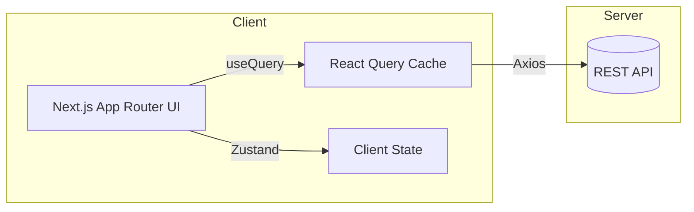

# 오메추 (오늘 뭐 먹지?)

사용자 기본 상태와 취향을 바탕으로 **상황 맞춤 메뉴와 맛집을 추천**하는 웹 서비스입니다.
Next.js + TypeScript + Tailwind CSS를 기반으로, 서버 상태는 TanStack Query, 클라이언트 상태는 Zustand로 관리합니다.

> 배포 URL: `https://your-deploy-url`
> 데모 계정: `user@example.com / user1234!`

---

## 목차

- [프로젝트 소개](#프로젝트-소개)
- [아키텍처](#아키텍처)
- [폴더 구조](#폴더-구조)
- [기술 스택 & 선정 이유](#기술-스택--선정-이유)
- [협업 규칙](#협업-규칙)
- [트러블슈팅 & 해결 과정](#트러블슈팅--해결-과정)
- [AI 활용 내역](#ai-활용-내역)

---

## 프로젝트 소개

\*\*오메추(오늘 뭐 먹지?)\*\*는 사용자의 기본 상태와 취향, 그날의 컨디션 같은 맥락을 반영해 **상황 맞춤 메뉴와 근처 맛집을 빠르게 추천**하는 웹 서비스입니다. 목표는 단순합니다. 고민 시간을 줄이고, 선택을 더 즐겁게 만드는 것.

### 문제 인식

- 반복되는 “오늘 뭐 먹지?”에서 오는 **의사결정 피로**.
- 검색·광고 중심 리스트로 인한 **정보 과잉**과 개인 맥락(컨디션/알레르기/식단) **부적합 추천**.
- 앱을 켰다가도 **탐색 흐름이 자주 끊기는 UX**(새로고침 시 상태 유실, 느린 응답, 빈약한 폴백 등).

### 해결 방식

1. **온보딩 5단계**(성별 → 상태 → 선호 음식 → 컨디션 → 알레르기)로 핵심 신호를 최소 입력으로 수집.
2. **컨텍스트 기반 탐색**: 태그/가격/정렬/검색(디바운스) + **무한 스크롤**로 탐색의 흐름을 유지.
3. **상세 페이지 실사용 시나리오**: 리뷰 정렬·필터, 신고 모달, 이미지 폴백, 평점 요약.
4. **마이페이지**에서 기본 상태와 취향을 재설정하여 추천의 정확도를 순환 개선.

현재 추천은 **규칙 기반 필터+정렬**로 시작해 안정적으로 동작하며, 로드맵에 개인화 점수/가중치 기반 고도화를 포함합니다.

### 차별점(UX/기술)

- **서버/클라이언트 상태 경계 명확화**: TanStack Query(캐싱·무효화·낙관적 업데이트) + Zustand(UI/온보딩 진행 등).
- **안정적인 미디어 처리**: 한글 파일명 **NFC/NFD 정규화**, 확장자 대소문자 통일, onError **폴백/재시도**.
- **네트워크/인증 분리**: `axiosInstance`(인증) vs `axiosPublicInstance`(공개 업로드)로 안전한 흐름 구성.
- **타입 안전과 복원성**: TypeScript 도메인 모델로 코드에서 도메인을 **역으로 복원 가능한(가역성)** 구조 지향.

### 타깃 사용자

- 점심·저녁 메뉴 결정을 빠르게 해야 하는 **직장인·학생**.
- **식단/알레르기/컨디션**을 고려해야 하는 이용자.
- 상황별로 가볍게 **새 메뉴를 탐색**하고 싶은 사용자.

### 가치/성공 지표(예시)

- 온보딩 **완료율**, 검색→상세 **전환율**, 찜/추천목록 **추가율**.
- LCP/CLS 등 **핵심 웹 지표**, 오류율, API 실패 시 폴백 성공률.

## 핵심 기능

### 1) 온보딩 5단계 진행도 바

- **사용자 가치**: 최소 입력으로 “나에게 맞는” 초기 추천 생성, 재방문 시 상태 복원.
- **주요 UX**: 단계별 저장/검증, 진행률 표시, 이전/다음 네비게이션, 중도 이탈 복원.
- **기술 포인트**: Zustand로 진행도/입력값 관리, 유효성 가드, 로컬 스토리지 스냅샷, 서버 동기화.
- **테스트 포인트**: 새로고침/뒤로가기에서도 값 유지, 부적합 입력 방지, 모바일 키보드 상호작용.

### 2) 메뉴/맛집 추천(검색·필터·정렬·무한 스크롤)

- **사용자 가치**: 조건을 바꿔도 끊기지 않는 탐색 경험.
- **주요 UX**: 태그/가격대 필터, 정렬(인기/최신/거리 등), 검색 디바운스, 스켈레톤/빈 상태/에러 상태.
- **기술 포인트**: TanStack Query `useInfiniteQuery` + 쿼리키 설계, `staleTime/gcTime` 조정, 프리패칭.
- **테스트 포인트**: 필터 조합 변화 시 캐시 무효화, 스크롤 경계, 네트워크 실패 폴백.

### 3) 맛집 상세 페이지

- **사용자 가치**: 결정에 필요한 정보(평점, 리뷰, 사진)를 한곳에서 빠르게 확인.
- **주요 UX**: 이미지 갤러리(지연 로딩·폴백), 리뷰 정렬/필터, 평점 요약, 신고 모달.
- **기술 포인트**: 이미지 onError 폴백, NFD→NFC 정규화, 접근성 대체 텍스트, 딥링크 가능 경로.
- **테스트 포인트**: 네트워크 지연/실패 시 폴백, 비어있는 리뷰/사진 처리, 모달 포커스 트랩.

### 4) 찜(Like) & 추천 목록 관리

- **사용자 가치**: 즉시 반응하는 피드백으로 탐색 리듬 유지.
- **주요 UX**: 리스트/상세 어디서든 찜 토글, 상태 일관 표시, 실패 시 사용자 안내.
- **기술 포인트**: `useMutation` **낙관적 업데이트** + 오류 롤백, 리스트/상세 쿼리 동기화, 무효화 전략.
- **테스트 포인트**: 빠른 연속 토글, 네트워크 오류 롤백, 로그인 만료 시 처리.

### 5) 마이페이지(프로필/기본 상태/FoodieLog/활동 내역)

- **사용자 가치**: 내 상태·취향을 지속적으로 다듬어 추천 정확도 향상.
- **주요 UX**: 프로필 수정, 기본 상태 관리, 먹부림 기록(정렬/기간 필터), 활동 내역 확인.
- **기술 포인트**: 보호 라우팅, 클라이언트 상태와 서버 상태 분리 저장, 무한 스크롤/페이지네이션.
- **테스트 포인트**: 권한 없는 접근 차단, 입력 유효성, 정렬/필터 일관성.

### 6) 인증(3단계 가입·보호 라우팅)

- **사용자 가치**: 명확하고 예측 가능한 가입 흐름, 보안이 유지된 개인화.
- **주요 UX**: 이메일 → 비밀번호 → 완료, 에러/유효성 메시지, 로그인 상태에 따른 접근 제어.
- **기술 포인트**: JWT 기반 인증, 인터셉터로 토큰 부착/에러 공통 처리, 라우트 가드.
- **테스트 포인트**: 토큰 만료/부재 시 리다이렉트, 비로그인 페이지 접근, 폼 유효성.

### 7) 이미지 업로드(공개/인증 분리·폴백)

- **사용자 가치**: 업로드/표시 실패 확률을 줄이고 사용자 혼란 최소화.
- **주요 UX**: 썸네일 미리보기, 업로드 진행 피드백, 실패 시 폴백 이미지.
- **기술 포인트**: `/v1/uploads/public`(무인증) vs `/v1/uploads`(인증) 분리, 파일명 **NFC 정규화**, 확장자 소문자.
- **테스트 포인트**: 대용량/특수문자 파일명, 네트워크 재시도, 썸네일/원본 동기화.

## 아키텍처

프론트엔드 단일 리포지토리에서 **App Router 기반의 라우팅**과 **서버/클라이언트 상태 분리 원칙**을 명확히 했습니다.



설계 원칙

- **Server State**(API 응답, 캐시·무효화 필요)는 TanStack Query로 일관 관리.
- **Client State**(온보딩 진행도, 모달 토글 등)는 Zustand로 경량 관리.
- API 계층을 \*\*`axiosInstance`/`axiosPublicInstance`\*\*로 분리해 인증 헤더·에러 공통 처리.
- 이미지 로딩 실패 대비 **NFC/NFD 정규화·확장자 대소문자 처리·폴백** 전략.

---

## 폴더 구조

상위 디렉토리 단위로 핵심 책임만 요약했습니다(세부 파일 목록 생략).

```text
.
├── (auth)             # 인증 전용 라우트 그룹(실제 URL 노출 없음)
├── api/               # Next.js Route Handler: 서버 API 프록시/유틸(예: 지오코드)
├── auth/              # 인증 관련 페이지 묶음(콜백, 재설정 등)
├── components/        # 공용 UI 컴포넌트(모달/입력/스켈레톤/헤더 등)
├── constant/          # 더미 데이터·상수·옵션
├── fullmenu/          # 전체 메뉴 탐색(필터/검색/리스트) 영역
├── lib/               # API 인스턴스, 공용 훅, 프로바이더, 상태 스토어, 타입
├── mainpage/          # 질문 기반 추천 플로우(예산/목적/무드 등)
├── mypage/            # 프로필/기본 상태/먹부림 기록/설정
├── onboarding/        # 5단계 온보딩 UI/훅
├── restaurant/        # 맛집 리스트·상세·지도(카카오 지도 포함)
├── globals.css        # 전역 스타일
├── layout.tsx         # 루트 레이아웃(App Router)
├── ClientLayout.tsx   # 클라이언트 전용 레이아웃
└── page.tsx           # 루트 페이지 엔트리
```

디렉토리 책임 원칙

- **페이지 단위 폴더**는 라우팅 경로를 그대로 반영합니다.
- **공용 로직/상태**는 `lib/`에, **공용 UI**는 `components/`에 모읍니다.
- **서버 상태**는 React Query, **클라이언트 상태**는 Zustand로 일관 분리합니다.

---

## 기술 스택 & 선정 이유

- **Next.js (App Router)**: 파일 기반 라우팅, 서버 컴포넌트 결합, SEO/성능, 라우트 그룹으로 인증 흐름 분리 용이.
- **TypeScript**: 도메인 모델 타입 안전, 리팩토링 내성, 런타임 오류 감소.
- **Tailwind CSS**: 반응형·상태별 스타일을 유틸리티로 일관 구성.
- **TanStack Query**: 캐싱·무효화·낙관적 업데이트·무한 스크롤 등 서버 상태 표준.
- **Zustand**: 온보딩/모달 등 클라이언트 상태 경량 관리.
- **Axios(dual instance)**: `axiosInstance`(인증) / `axiosPublicInstance`(공개 업로드)로 네트워크 흐름 명확화.
- **ESLint + Prettier**: 일관된 코드 스타일과 CI 검증.

---

## 협업 규칙

협업을 위한 커밋 컨벤션입니다. 태그를 사용해 커밋의 목적을 명확히 구분합니다.

| 태그        | 설명 |
|-------------|------|
| `feat`      | 새로운 기능 추가 |
| `fix`       | 버그 수정 |
| `docs`      | 문서 수정 (README, 주석 등) |
| `style`     | 코드 스타일 변경 (세미콜론, 들여쓰기 등) |
| `design`    | 사용자 UI 디자인 변경 (CSS, Tailwind 등) |
| `test`      | 테스트 코드 작성/수정 |
| `refactor`  | 기능 변화 없는 리팩토링 (로직 개선 등) |
| `build`     | 빌드 설정 파일 수정 |
| `ci`        | CI 설정 변경 (GitHub Actions, Husky 등) |
| `perf`      | 성능 개선 (렌더링 최적화 등) |
| `chore`     | 설정, 패키지 설치 등 기타 작업 |
| `rename`    | 파일 또는 폴더 이름 변경 |
| `remove`    | 파일 또는 리소스 삭제 |
| `wip`       | 작업 중인 임시 커밋 (Work In Progress) |
| `hotfix`    | 운영 중 긴급 버그 수정 |

---

### ✅ 커밋 메시지 작성 규칙

- **한 작업 단위당 하나의 커밋**으로 나눕니다.
- 메시지는 **간결하고 명확하게** 작성합니다.
- **이슈 번호가 있다면 `#번호`를 함께 명시**합니다.

```bash
feat: 감정 선택 페이지 레이아웃 구현 #12
fix: 로그인 실패 시 에러 메시지 출력 오류 수정 #7
docs: README에 커밋 컨벤션 항목 추가 #3
style: Prettier로 코드 포맷 일괄 정리 #4
design: 감정 선택 카드 UI 개선 (hover 효과) #5
test: DiaryList 렌더링 테스트 코드 추가 #6
refactor: useDiary 훅으로 상태 로직 분리 #7
build: next.config.ts에 이미지 도메인 설정 추가 #8
ci: push 시 lint 자동 검사 추가 #9
perf: EmotionItem 렌더링 useMemo로 최적화 #10
chore: tailwind.config.js에 모바일 breakpoints 추가 #11
rename: EmotionItem → EmotionSelector로 컴포넌트 이름 변경 #12
remove: 사용하지 않는 test-data.json 삭제 #13
wip: 감정 필터 기능 작업 중 #14
hotfix: 배포 후 발견된 메뉴 추천 API 오류 긴급 수정 #15
```


---

## 트러블슈팅 & 해결 과정

- 링크 :
- **검색 직후 자동 재검색**: `submittedTerm`(검색 기준)과 `inputValue`(UI)를 분리, 초기화 직후 입력 무시 플래그 재설계, 빈 문자열 검색은 전체 목록 반환.
- **이미지 한글 파일명(NFC/NFD)**: 업로드 시 **NFC 정규화**, 공백/제어문자 제거, 확장자 소문자; 클라이언트는 onError 재시도·폴백.
- **공개/인증 업로드 분리**: 회원가입 단계 401 이슈를 `axiosPublicInstance` + `/v1/uploads/public`로 해결.
- **Next.js 동적 라우팅 타입 오류**: 상세/마이페이지 일부를 **Client Component**로 전환하고 `useParams()` 사용.
- **react-datepicker 검증 누락**: `minDate/maxDate/selectsRange` 등 제어형 props로 강제 + setState 직전 가드.
- **찜 토글 지연**: React Query `useMutation`의 `onMutate/onError/onSettled`로 **낙관적 업데이트** 도입.

> 상세 데이터/로그/스크린샷은 노션 문서에 보관 (제출 시 링크 첨부 가능).

---

## AI 활용 내역

- **Gemini 기반 코드 리뷰**: PR 전후로 컴포넌트 경계, prop 드릴링, React Query 쿼리키 설계, 에러 처리 패턴을 점검하고 리팩토링 아이디어를 도출.
